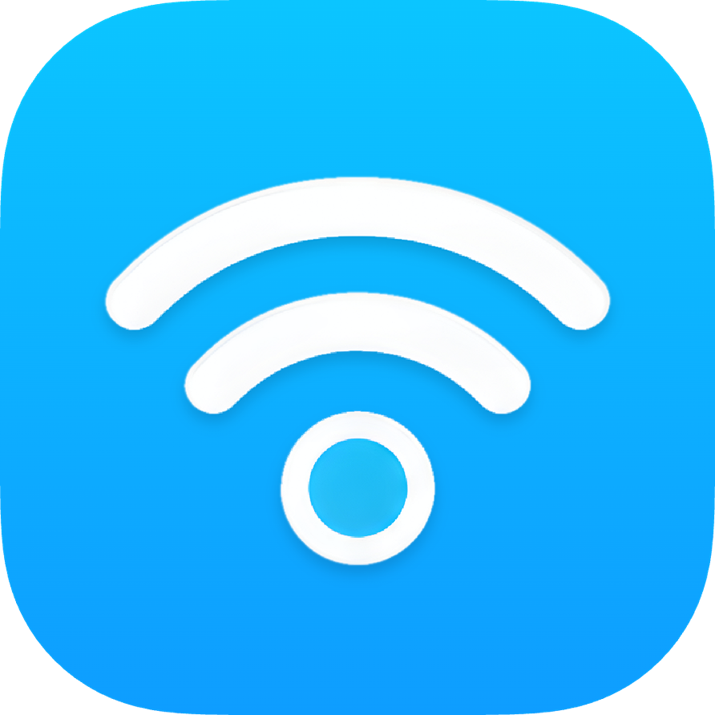
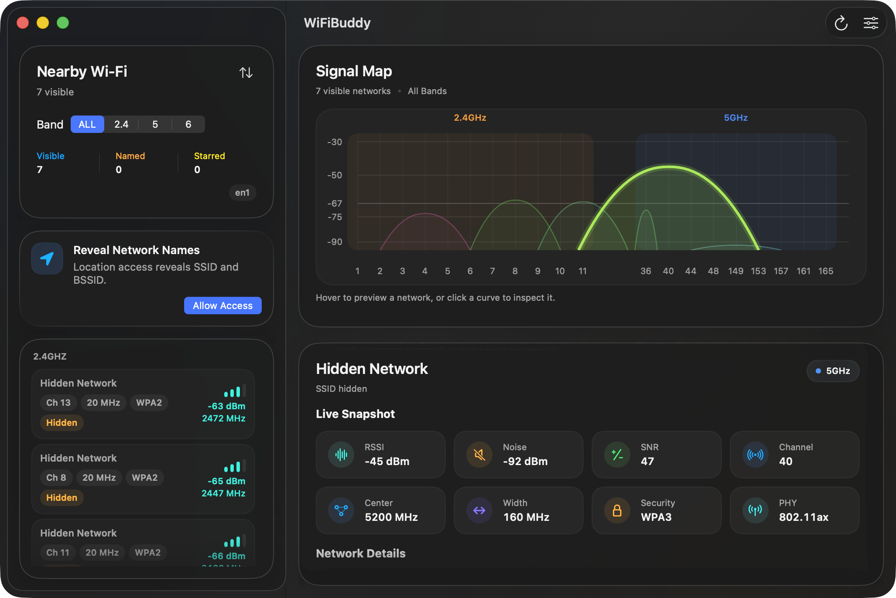
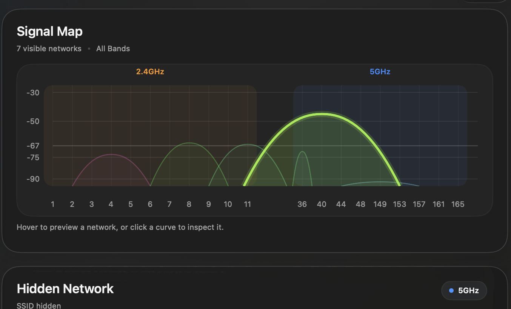
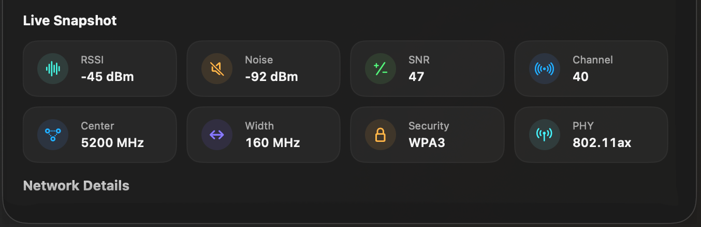
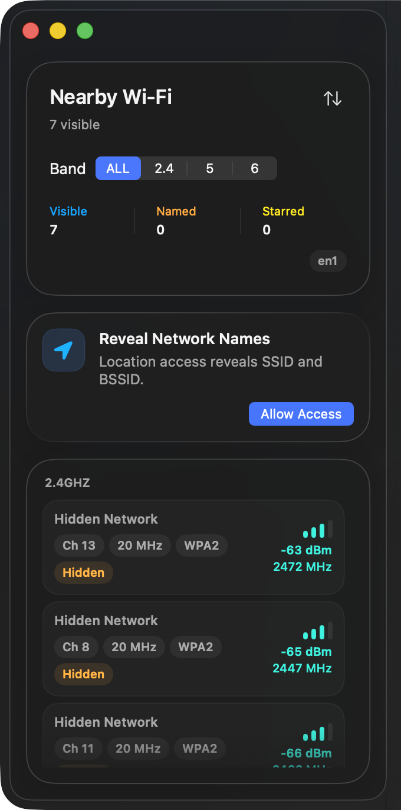

<div align="center">



# WiFiBuddy

**A modern Wi-Fi analyzer built for macOS 26, crafted in Liquid Glass.**

See every access point around you, watch the spectrum light up in real time,
and pick the cleanest channel — all in a native SwiftUI app that feels like
it shipped with the OS.

[](https://www.apple.com/macos/)
[](https://swift.org)
[](https://developer.apple.com/design/)
[](LICENSE)

<br />

<!-- Hero: a full shot of the main window at launch. -->


</div>

---

## ✨ Highlights

| | |
| :-- | :-- |
| 📡 **Real-time Signal Map** | A beautiful per-band channel plot that traces every AP's signal envelope, colored by band (2.4 / 5 / 6 GHz) and highlighted when selected. |
| 🧭 **Regulatory-aware** | Built-in channel policies for 18 regions (US, CA, EU, GB, JP, KR, CN, HK, TW, SG, IN, AU, NZ, BR, MX, …). The recommendations always respect your local allowed channels. |
| ⭐️ **Starred vs. Owner** | Distinguish networks you care about (starred) from the one you're currently connected to (owner) — both indicators coexist, never collide. |
| 🔍 **Deep Network Detail** | RSSI, noise, SNR, center frequency, channel width, security, PHY modes, information elements — everything your OS exposes, laid out cleanly. |
| 🎨 **Liquid Glass UI** | Translucent glass panels, soft radial blooms, tinted rims, and rounded corners that hug macOS 26's design language. |
| 🌏 **Multilingual** | Full UI available in English, 简体中文, 日本語, 한국어, and the language selector lives inside the app — no system restart required. |
| 🧪 **Zero-config scans** | Uses CoreWLAN + CoreLocation. Grant access once and WiFiBuddy keeps the list live without re-prompting. |

---

## 📸 Screenshots

<p align="center">
  
</p>

<p align="center">
  
  
</p>

<p align="center">
  
</p>

---

## 📥 Install

### Download a pre-built DMG

Grab the latest build from the [Releases page](../../releases).

1. Double-click the downloaded `.dmg`
2. Drag **WiFiBuddy** into **Applications**
3. First launch: right-click the app → **Open** (the DMG is **not notarized**
   — right-click Open tells Gatekeeper you trust it).

> Prefer a stable build? Look for the release tagged `vX.Y.Z` and marked
> "Latest". Testing a beta? Open any tag marked _Pre-release_, they're named
> like `vX.Y.Z-beta.N`.

### Build from source

Requires macOS 14 or newer and the Swift 6.2 toolchain (ships with Xcode 15.4+).

```bash
git clone https://github.com/backrunner/WiFiBuddy.git
cd WiFiBuddy

# Fast inner loop: build and run the unsigned executable
swift run

# Or build a proper .app bundle and launch it
bash Scripts/package_app.sh release
bash Scripts/launch.sh
```

Tests:

```bash
swift test
```

---

## 🧱 Architecture

```
Sources/WiFiBuddy/
  App/           @main entry, navigation model, dependency wiring
  Domain/        Pure data models: observations, regions, snapshots
  Services/      CoreWLAN scanner, favorites, permissions, region policies
  SharedUI/      Liquid Glass tokens + reusable components
  Features/
    AppShell/    Window chrome and two-column split layout
    Sidebar/     Nearby Wi-Fi list with sort, filter, live stats
    AnalyzerChart/  Signal Map canvas with hit-testing and region curves
    Inspector/   Per-network deep dive
    Settings/    Compact single-screen preferences (scan / region / language)
  Resources/     Region policies JSON, app icon, localization catalogs
  Support/       Formatters, selection policy, helpers
```

### Highlights

- **Pure SwiftUI**, no AppKit bridging beyond what CoreWLAN + `NSPasteboard`
  require.
- **Liquid Glass** implemented via `glassEffect(.regular, in:)` on
  macOS 26 with a graceful `.regularMaterial` fallback for macOS 14+.
- **Canvas-drawn Signal Map** — every curve is a Swift `Path` so it renders
  crisp at any window size. Selected / starred strokes are clipped to the
  chart's drawable region to keep edges clean.
- **Localization** uses standard `.lproj/Localizable.strings` catalogs. The
  language picker writes to `UserDefaults` under the app's domain so the
  change survives across launches.

---

## 🛠 Development scripts

All scripts live under `Scripts/`.

| Script | What it does |
| :-- | :-- |
| `package_app.sh [release\|debug]` | Compiles and wraps the binary into a macOS `.app` bundle, regenerates the icon, signs ad-hoc. |
| `launch.sh` | Opens the last built `.app`. |
| `package_dmg.sh` | Builds the `.app` then produces a UDZO `.dmg` with an `/Applications` drop target. |
| `generate_icon.swift <out.icns> [scratch]` | Pure-AppKit renderer for the Liquid Glass icon. Writes a full macOS iconset + `.icns`. |
| `tag_release.sh <version> [--push]` | Bumps `version.env`, commits `release: vX.Y.Z`, and cuts an annotated git tag. |

### Cutting a release

```bash
# Cut a beta and let CI build + publish it
bash Scripts/tag_release.sh 0.2.0-beta.1 --push

# Promote to a stable release
bash Scripts/tag_release.sh 0.2.0 --push
```

The [release workflow](.github/workflows/release.yml) treats any tag
containing `-` as a SemVer prerelease — those land on the Releases page as
"Pre-release" and don't steal the "Latest" badge from stable builds.

---

## 🌐 Languages

WiFiBuddy ships with four localized catalogs out of the box:

| Code | Language |
| :-- | :-- |
| `en` | English |
| `zh-Hans` | 简体中文 |
| `ja` | 日本語 |
| `ko` | 한국어 |

Switch languages from **Settings → Language** — the change is scoped to
WiFiBuddy only, no system-wide override. Restart the app to apply.

Contributing a new locale? Add a sibling `.lproj/` folder under
`Sources/WiFiBuddy/Resources/`, mirror the key set, and the app will pick it
up on the next launch.

---

## 🔐 Privacy

WiFiBuddy runs **entirely on-device**. It never uploads the scan list,
never phones home, and has no analytics SDK. Location permission is
required only because macOS gates access to SSID / BSSID metadata behind
Core Location — once granted, WiFiBuddy uses the data locally and forgets
it the moment the app quits.

---

## 🤝 Contributing

Pull requests are welcome. Please run `swift test` before submitting and
keep new localized strings in sync across all four catalogs.

When filing a bug, a screenshot of the window and the output of
`/System/Library/PrivateFrameworks/Apple80211.framework/Resources/airport -I`
are extremely helpful.

---

## 📄 License

WiFiBuddy is released under the [MIT License](LICENSE).
